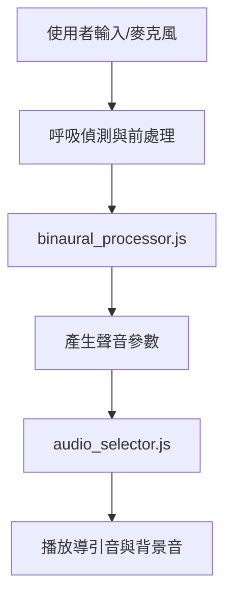

# 專案架構與核心運作說明

本專案提供動態拍頻引導音效服務，並整合多語系介面與網站分析。以下內容概述整體流程與主要模組。詳細輸入與輸出格式請參考 [docs/binaural_processor.md](docs/binaural_processor.md)。

## 目錄

1. [整體流程架構](#整體流程架構)
2. [主要模組職責](#主要模組職責)
3. [擴展說明](#擴展說明)

---

## 整體流程架構

---

## 主要模組職責

| 模組 | 位置 | 主要功能 |
| --- | --- | --- |
| 拍頻音訊與呼吸推論 | `js/binaural_processor.js` | 計算拍頻與音量等參數 |
| 音訊選擇與切換 | `js/audio_selector.js` | 依狀態載入與播放音檔 |
| 多語系支援 | `js/i18n.js` | 介面與文字多語系化 |
| GA 分析 | `js/ga.js` | Google Analytics 事件追蹤 |

> `binaural_processor.js` 的計算流程與參數說明請見相關文件。

---

## 擴展說明

專案採模組化設計，可自由替換拍頻演算、音源或前端框架。如需進一步整合其他裝置或服務，建議遵循相同的輸入/輸出結構以保持相容性。
