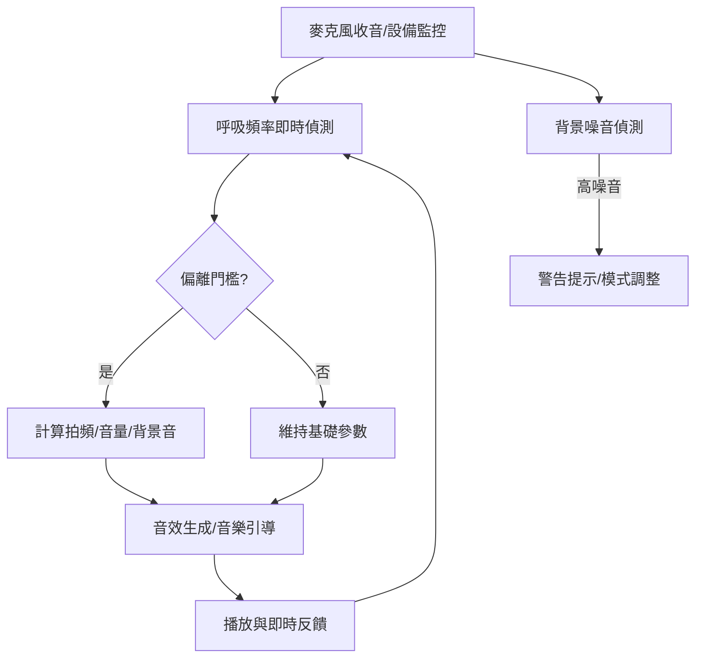

# 專案架構與核心運作說明

本專案提供動態拍頻引導音效服務，並支援呼吸推論、多語系、數據分析與多音源選擇功能。

## 目錄

1. [整體流程架構](#整體流程架構)
2. [核心運作公式與輸入輸出](#核心運作公式與輸入輸出)
3. [主要模組職責](#主要模組職責)
4. [擴展說明](#擴展說明)

---

## 整體流程架構

---

## 主要模組職責

| 模組                   | 位置                        | 主要功能                         |
|------------------------|-----------------------------|----------------------------------|
| 拍頻音訊與呼吸推論     | `js/binaural_processor.js`  | 音訊生成、呼吸判斷核心           |
| 音訊選擇與切換         | `js/audio_selector.js`       | 依情境切換導引音、背景音         |
| 多語系支援             | `js/i18n.js`                | 介面與訊息多語系化               |
| GA 分析                | `js/ga.js`                  | Google Analytics 數據與事件追蹤  |

> 詳細技術規格，請見 docs/ 子目錄中各 md 文件。
