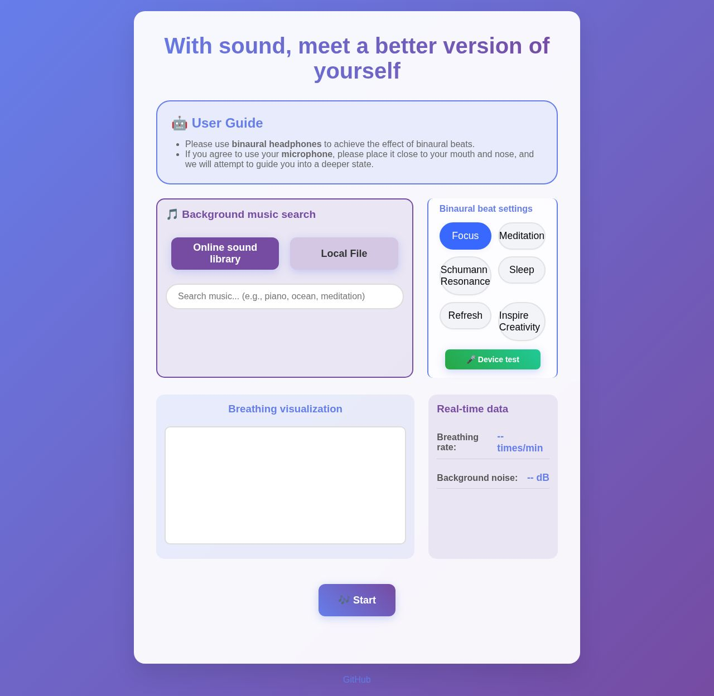

# Vuko — binaural beats that adapt to your breathing, in your browser

[](https://www.vuko.life/)
[](LICENSE)


**Free, open-source, no signup, no install.** Vuko generates binaural beats with the Web Audio API and — if you allow microphone access — listens to your breathing rhythm and adapts the beat frequency to it in real time. Everything runs locally in your browser; no audio ever leaves your device.

**▶ Try it: [www.vuko.life](https://www.vuko.life/)**



## Why another binaural beats app?

Every binaural beats app plays a fixed frequency at you. Vuko closes the loop: it detects your breathing through the microphone and nudges the beat frequency along with you — slowing as you slow down. Pick a target state and Vuko guides you there:

| Mode | Beat frequency | Brainwave band | Best for |
|------|---------------|----------------|----------|
| Focus | 10 Hz | Alpha | Work, study and concentration |
| Meditation | 7 Hz | Theta | Deep relaxation and mindfulness |
| Schumann resonance | 7.83 Hz | Theta | Grounding and balance |
| Sleep | 3 Hz | Delta | Falling asleep faster |
| Refresh | 15 Hz | Beta | Alertness and energy |
| Inspiration | 40 Hz | Gamma | Creative thinking |

Plus a built-in library of ambient tracks with **semantic search** — type what you feel like ("rain on a tent", "temple bells") and it finds matching music via sentence-transformer embeddings, entirely client-side.

## Privacy by architecture

- Microphone audio is processed **only in your browser** (MediaStream + Web Audio API). Nothing is uploaded — there is no backend at all; the whole site is static files on GitHub Pages.
- No account, no paywall, no ads.
- MIT licensed. Fork it, self-host it, remix it.

## Tech notes

Pure HTML/CSS/vanilla JS — no framework, no npm, no build step for the app itself.

- `js/binaural_processor.js` — binaural beat synthesis (per-ear oscillators) + breathing-rate inference
- `js/audio_selector.js` — semantic music search over precomputed embeddings (`music/base.json`, `all-MiniLM-L6-v2`)
- `js/i18n.js` + `i18n/` — 30 languages, statically prerendered per language (`app/<lang>.html`)
- `.github/scripts/` — Python CI automation: content prerender, embedding refresh, screenshots

### Run locally

```bash
git clone https://github.com/weiqi-kids/vuko.life.git
cd vuko.life
python -m http.server 8000   # any static server works
```

### Regenerate music embeddings

```bash
python .github/scripts/embedding.py music/base.json
```

Requires `sentence-transformers` (downloads the `all-MiniLM-L6-v2` weights on first run).

## Contributing

Issues and PRs are welcome — translations, new ambient tracks, breathing-detection improvements, or anything else. The 30 language files live in `i18n/` (machine-translated baseline + human overrides in `i18n/overrides/`); corrections from native speakers are especially appreciated.

---

## 中文簡介

Vuko 是免費、開源、免註冊的呼吸自適應雙耳拍頻 Web App：透過麥克風即時偵測你的呼吸節奏，動態調整拍頻，引導你進入睡眠、冥想、放鬆或專注狀態。所有音訊皆在瀏覽器本機處理，不上傳任何資料。線上體驗：[www.vuko.life](https://www.vuko.life/)。

## License

[MIT](LICENSE) © 2025 Light

*Vuko is a wellness tool, not a medical device. Binaural beats research is ongoing; effects vary by individual.*
